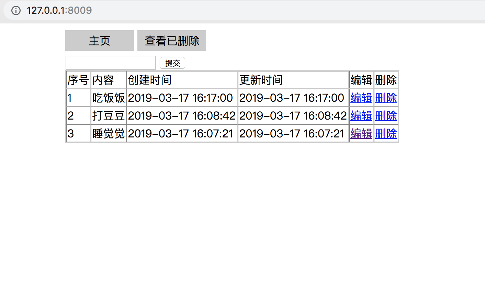
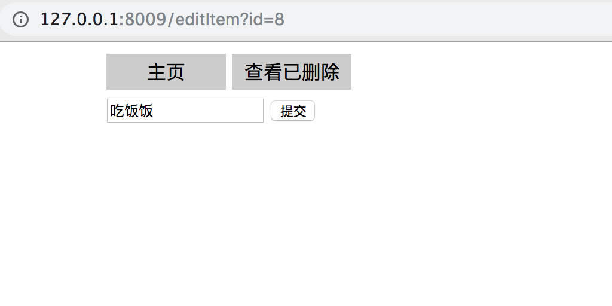

# ThinkPHPTodoList

使用ThinkPHP5.0 实现的一个简易TodoList

主页查看、删除、添加功能


编辑功能


thinkphp_5.0.24_with_extend

mac环境下配置
```
# 查看nginx配置文件所在
$ brew info nginx

# 配置文件
cd /usr/local/etc/nginx/conf.d
vim php_site.conf

# 重启nginx
brew services restart nginx

```
建表
```
CREATE TABLE `todo_list`  (
  `id` int(11) NOT NULL AUTO_INCREMENT,
  `content` varchar(255) NULL DEFAULT '',
  `create_time` int(11) NULL,
  `update_time` int(11) NULL,
  `delete_time` int(11) NULL,
  PRIMARY KEY (`id`)
);
```

# 参考文章
0. [ThinkPHP5.0完全开发手册](https://www.kancloud.cn/manual/thinkphp5/118003)
1. [PHP：ThinkPHP5.0配置nginx](https://blog.csdn.net/mouday/article/details/88425964)
2. [PHP：ThinkPHP5.0下载安装和各种配置](https://blog.csdn.net/mouday/article/details/88544479)
3. [PHP：ThinkPHP5.0请求对象和响应对象](https://blog.csdn.net/mouday/article/details/88587125)
4. [PHP：ThinkPHP5.0视图View模板语法](https://blog.csdn.net/mouday/article/details/88595682)
5. [PHP：ThinkPHP5数据库操作增删改查-Db类](https://blog.csdn.net/mouday/article/details/88601446)
6. [PHP：ThinkPHP5数据库操作增删改查-Model类](https://blog.csdn.net/mouday/article/details/88615703)
